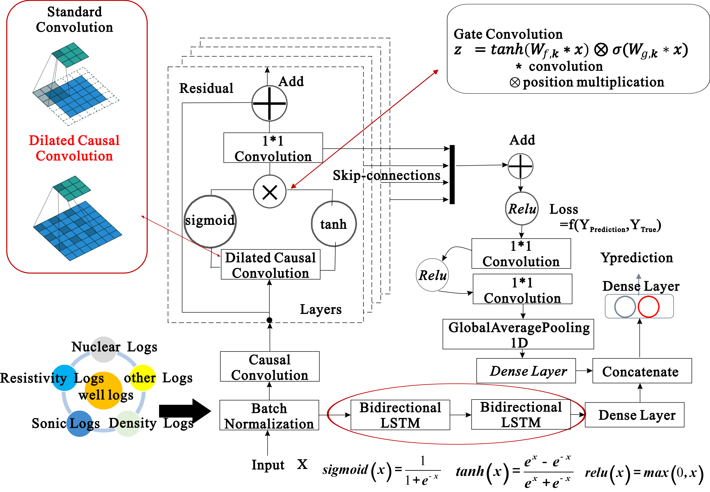

# TLBWSS

### Description
It's an implements about "Transfer learning based on weights of similarity sample for well logging evaluation method 
and application".

#### Software Architecture
Software architecture is based on python 3.10+, tesorflow 2.4+, 

#### Requirement
matplotlib>=3.5.2  
numpy>=1.22.4  
pandas==2.2.2  
pydot_ng==2.0.0  
pygame==2.1.2  
scikit_learn==1.1.2  
scipy==1.14.1  
seaborn==0.11.0  
statsmodels==0.14.2  
tensorflow_gpu>=2.4.0  

#### Instructions

1. prepare_data_utils_notebooks folder has the code about data preprocessing.
2. curve_reconstract_TF show the model about double experts network, and other new models could be added into senmodels.py.
3. lithofacies_classification_TF is BiGRU-MHSA model to help to lithofacies classification, and other new models could be added into senmodels_classification.py
4. data folder is example data.

**Figure 1 workflow chart**

**Figure 2 double experts network**

**Figure 3 BiGRU-MHSA network**

Email: xbs150@163.com

