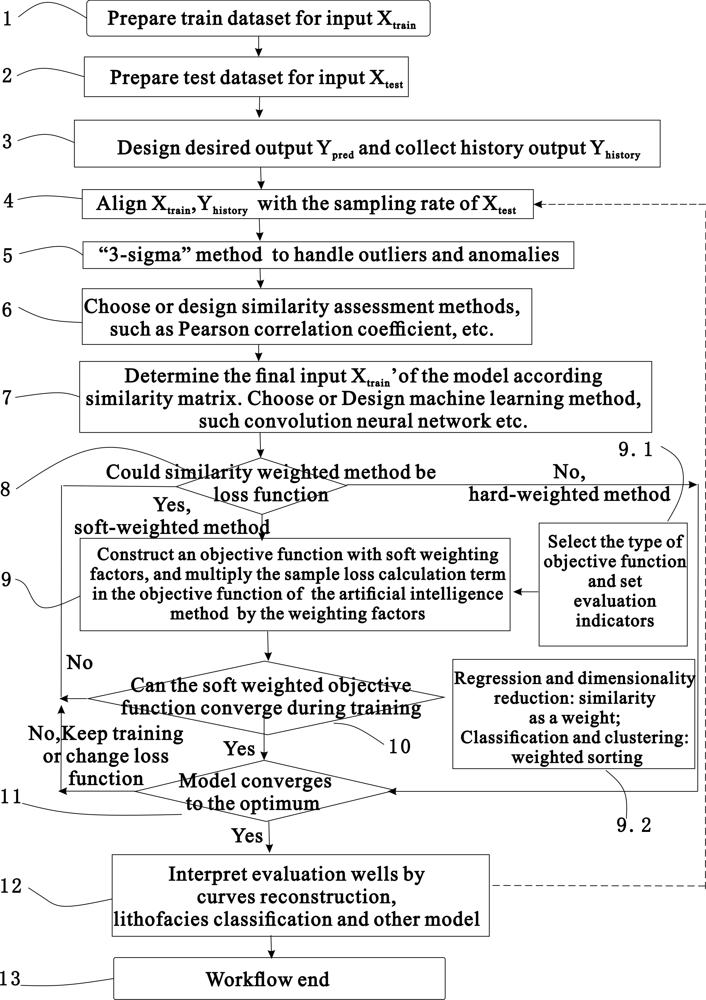
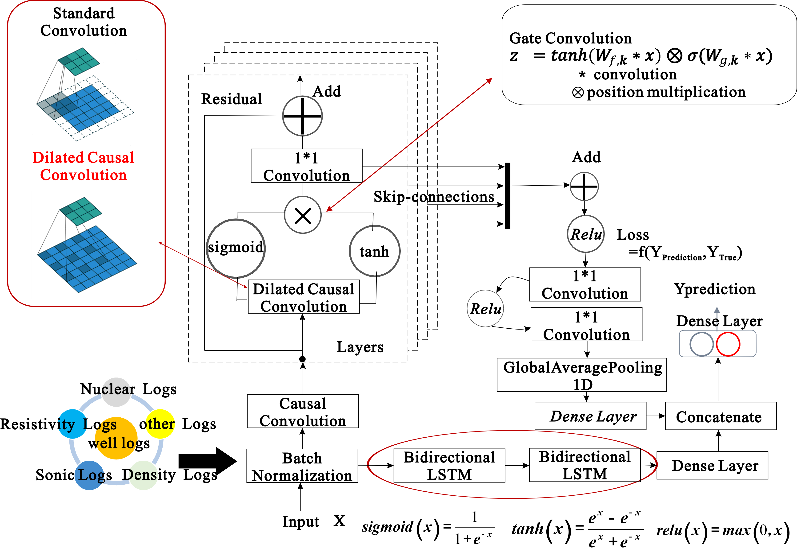
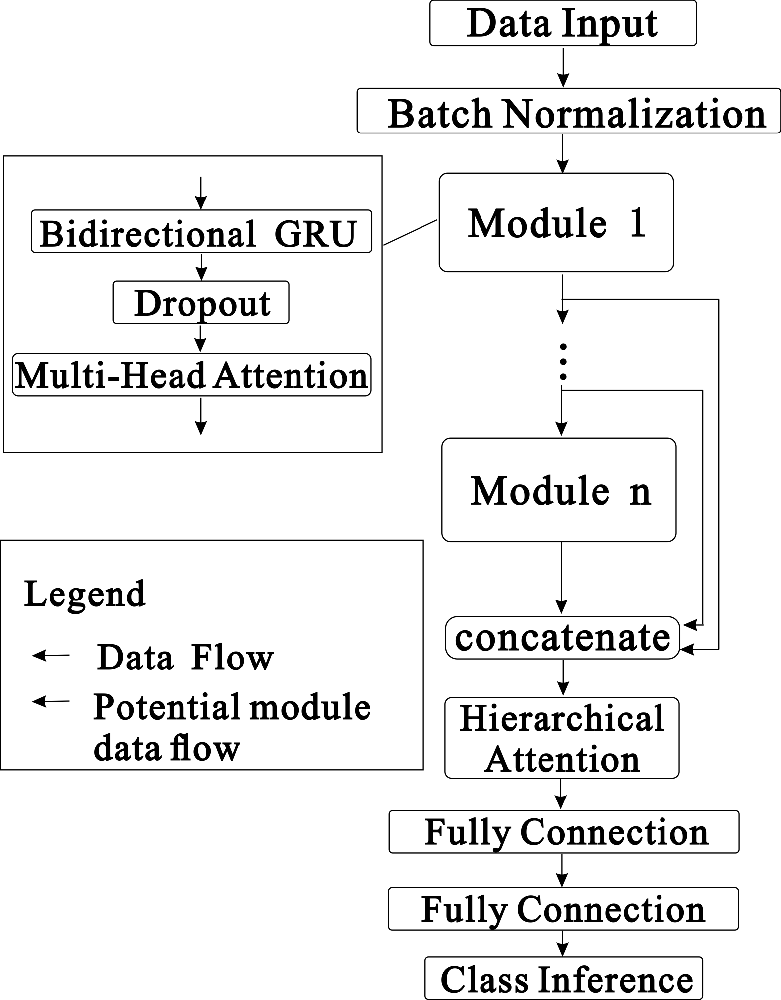

# TLBWSS

### 描述
这是杂志Artificial Intelligence in Geosciences一种关于《基于相似性样本权重迁移学习的测井地层评价方法》的实现和应用。DOI: [https://doi.org/10.1016/j.aiig.2024.100091](https://doi.org/10.1016/j.aiig.2024.100091)


#### 软件架构
软件架构基于 python 3.10+、tesorflow 2.4+、, xgboost, scikit-learn
需要先安装Grpahviz（https://graphviz.org/download/）用于可视化绘制神经网络模型
#### 要求
matplotlib>=3.5.2  
numpy>=1.22.4  
pandas==2.2.2  
pydot_ng==2.0.0  
pygame==2.1.2  
scikit_learn==1.1.2  
scipy==1.14.1  
seaborn==0.11.0  
statsmodels==0.14.2  
tensorflow_gpu==2.9.0  
graphviz  
scikit-learn==1.1.2  
xgboost==2.1.1  
#### 说明

以下是您提供内容的中文翻译：

---

1. **prepare_data_utils_notebooks** 文件夹包含数据预处理的代码。您可以按照注释中的说明处理自定义数据。  
2. **curve_reconstruct_TF** 笔记本展示了基于双专家网络的模型，其他新模型可以被添加到 **senmodels.py** 中。  
3. **lithofacies_classification_TF** 笔记本包含一个 BiGRU-MHSA 模型，旨在帮助进行岩相分类。其他新模型也可以添加到 **senmodels_classification.py** 中。  
4. **data** 文件夹包含示例数据。默认的数据文件格式为 CSV，输入数据类型为 NumPy 的 ndarray。  

在训练模型时，请将代码中的变量设置为 `model_stage == "train"`。在对测试数据集进行推断时，请将其更改为 `model_stage == "test"`。该操作适用于 **curve_reconstruct_TF** 和 **lithofacies_classification_TF**，例如在 **tf2_curve_reconstruct.ipynb** 和 **tf2_facies_classification.ipynb** 中。

---

如需进一步修改或澄清，请随时告知！



**图 1 工作流程图**


**图 2 双专家网**


**图 3 BiGRU-MHSA 网络**
**引用**
```
Binsen Xu, Zhou Feng, Jun Zhou, Rongbo Shao, Hongliang Wu, Peng Liu, Han Tian, Weizhong Li, Lizhi Xiao, 2024. Transfer learning for well logging formation evaluation using similarity weights. Artificial Intelligence in Geosciences. Vol 5. DOI: https://doi.org/10.1016/j.aiig.2024.100091
```
电子邮件： xbs150@163.com
